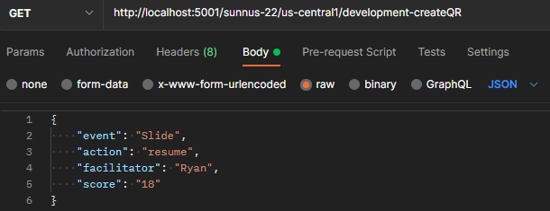

# SunNUS 22 Cloud Repo :cloud:


## Developed with :heart: in:

<p align="center">
   <span>
      
      
      
   </span>
</p>

## What is this repo for?

This repo is used to contain all the Firebase [cloud functions](https://firebase.google.com/docs/functions) for the SunNUS 22 mobile app. 
It facilitates backend functions to our application, thus allowing us develoepers to call them without invoking them from the application itself.

If you would like to learn more about the project in general or need a starting point, you may refer to the docs repo.

If you would like to learn more about how the frontend is built, you may refer to the app repo.

## Repo structure

This repo has two main directories: `functions` and `tests`.

`functions` contain the logic for the `onRequest` and `onCall` backend functions.

`tests` contain testing files that can be executed in `node` for the respective cloud functions.

## Setup

*Pre-requisites:*
- [node](https://nodejs.org/en/download/current/) **v16 and above**
- [yarn](https://classic.yarnpkg.com/en/docs/install#windows-stable) **strictly v1**
- [git](https://git-scm.com/downloads)
- Ensure that you are part of the project on Firebase.

More detailed explanations on installation process can be found in docs repo.

Clone the repo. A folder called `cloud` should appear. After cloning the repo, install
node packages by running `yarn` in these directories:

- `cloud`
- `cloud/functions`
- `cloud/tests`

Then log in into firebase using the CLI: (assuming you're in `cloud`)
1. `cd functions`
2. `yarn firebase login`

## Writing your first function

*Pre-requisites:*
- Basic understanding of HTTP requests and response
- Firebase cloud functions

Here's an example workflow of how I write a `helloWorld` cloud function.
It is recommended to complete the tutorial in order as they build on the same example.

1. Setting up server-side
2. Setting up client tester

### 1. Setting up server-side

1. Export a new `onRequest` function `helloWorld` in
   `cloud/functions/src/helloWorld.ts`

```js
export const helloWorld = https.onRequest(async (req, res) => {
  console.debug('hello, server!')
  res.json({
    message: 'hello, requester!',
    serverReceived: req.body,
  })
})
```

Here, we are creating a type of cloud function, taking the form of an onRequest. 
Users who wish to call this function can attach a message in the request object `req`, and it will be reflected in the response `res`. 
More will be elaborated on in the later parts.

2. Add it to the list of cloud functions to be used by exporting it in `cloud/functions/src/development.ts`.

3. Spin up a local emulator server

Linux/ MacOS:
```bash
cd functions && yarn serve
```

Windows:

```bash
cd functions && yarn start:functions
```

4. Your terminal should show a list of local urls, one of which ends in
   `helloWorld`.


5. Go to that link in your browser. After loading, both your terminal and your
   browser should have the output as specified in the function above.


6. Congrats! :tada: You've just written your very first cloud function!

### Setting up client tester

To avoid needing to navigate to the link each time, you can use a simple
node.js request sender and run it locally.

Let us continue by building on the `helloWorld` function built previously.

7. Navigate to `cloud/tests/src` and create a new file called `helloWorld.ts`.

```js
const fn = 'development-helloWorld'
timestamp(fn)

const request = { message: 'requester to server, over!' }

axios.post(cloud(fn), request).then((res) => {
  console.debug(res.data)
})
```

Here, we are referencing the cloud function we have just added to development. 
We can then use [axios](https://flaviocopes.com/node-axios/) to run our HTTP request.
Previously, we did not attach a request and as such, our serverReceived did not return anything. 
Let us now attach a message to our request payload.

8. Create a script in `cloud/tests/package.json` to build and run it. 
You may do so by creating an alias (i.e shortcut for the command)
For example, let us call our alias `hw` for `helloWorld`. 
This way, we can simply call `yarn hw` instead of running `yarn tsc && node lib/helloWorld`.


9. Let us test the function by running the following:

```bash
cd tests && yarn tsc && node lib/helloWorld.ts

# or simply (if alias is set up correctly)
cd tests && yarn hw
```

A message should pop up in your terminal with a timestamp, showcasing the function called as well as the response object.

10. Congrats! :tada: You've just written your very first test function using node and axios!

11. Let us take it a step further and pass in parameters into our cloud function. The function should now echo a hello back to the user.


12. Modify your `helloWorld` to return a message reflecting the name attached to the request payload. 
Attach the name you want to return as a property of the request object in `index`.
```js
// helloWorld.ts
message: `hello, ${req.body.name}!`,

// index.ts
const request = { name: 'Khang' }
```

13. Run the function as before, now you have successfully learnt how to attach parameters onto your request body!

### Testing with external applications

Alternatively, you may download API Clients such as [Postman](https://www.postman.com/) or [Insomnia](https://insomnia.rest/) and form a payload from there.

Supplying inputs from Postman example:

Using `createQR.ts` as an example, the cloud function requires four parameters to be supplied.
You may supply them in a JSON object in the GET request as follows:

```json
{
   "event": "Slide",
   "action": "resume",
   "facilitator": "Ryan",
   "score": "18"
}
```



## Useful aliases

Here are some useful aliases to run, for a more comprehensive list, refer to the respective `package.json` files.

### Setup Sequence

| command  | description                  |
| -------- | ---------------------------- |
| yarn cu  | create users                 |
| yarn ct  | create teams                 |
| yarn au  | attach users to teams        |
| yarn att | assign TSS teams their slots |
| yarn cs  | create schedule              |

### Teardown sequence

| command  | description      |
| -------- | ---------------- |
| yarn dau | delete all users |
| yarn dat | delete all teams |
| yarn ds  | delete schedule  |

## Downloading sign up information

Contact the tech lead to get the link to the google sheets.

[](https://docs.google.com/spreadsheets/d/1e0zkoT6qQA8gBkd8QvvVuGR332QLotJ94dPJmIo-4BI) 

1. Download registration csvs from Google Sheets
   - createTeams
   - createUsers
2. Place them into the `tests/src/csv` and commit the changes
   - Do ensure that the data is correct!